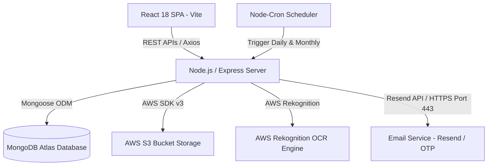
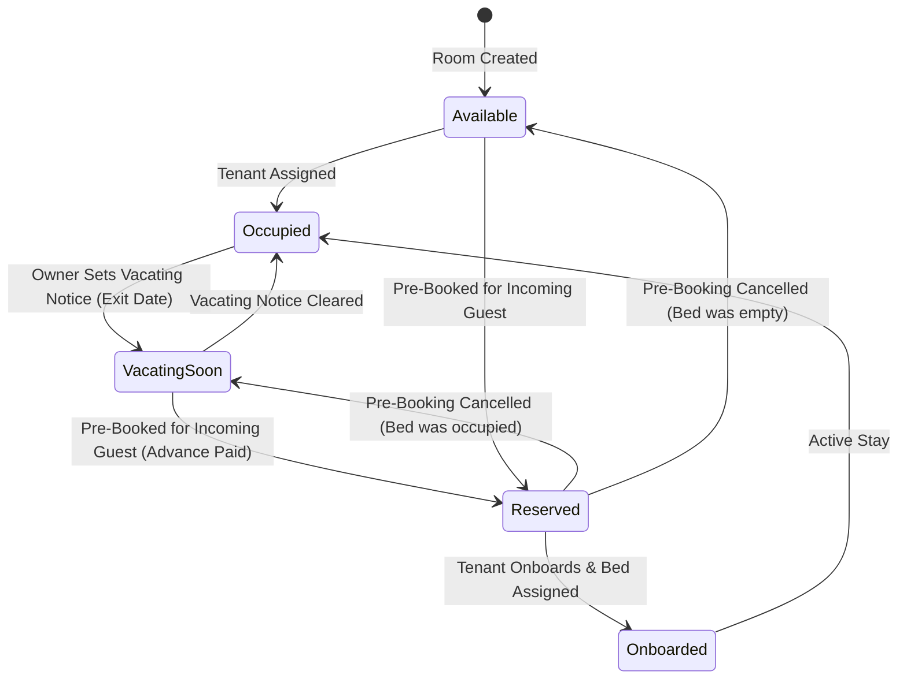

# StaySync PG Management Web Application — Product Requirement Document (PRD)

## Executive Summary

**StaySync** is an end-to-end Paying Guest (PG) management platform and stay-discovery web application. It modernizes and automates operations for property owners, property managers, tenants (students & working professionals), and operational staff. 

By replacing fragmented manual tools (paper logs, spreadsheets, physical cash receipts) with automated rent invoicing, prorated billing, automated late-fee calculation, staff payroll, operational expense logging, geolocated stay discovery, 6-step tenant onboarding wizards, pre-booking advance management, vacating notice tracking, and AWS Rekognition OCR identity verification (KYC), StaySync serves as a unified digital ecosystem for PG real estate operations.

---

## 1. Vision, Objectives & Core Metrics

### 1.1 Product Vision
To build an intelligent, transparent, and seamless property management platform that simplifies accommodation discovery for tenants while empowering property owners to run multi-property PG businesses with zero revenue leakage, pre-booked bed pipelines, and maximum occupancy rates.

### 1.2 Key Objectives
- **Zero Revenue Leakage**: Automated monthly invoice generation on the 1st of every month at 00:01 AM, combined with midnight cron scripts enforcing late fee penalties.
- **Geolocated Stay Discovery**: Real-time vacancy updates linked to MongoDB `2dsphere` spatial coordinates, allowing tenants to search within specific radiuses (in kilometers) using HTML5 Geolocation.
- **Trust & KYC Security**: Automated Aadhar document text extraction and verification using AWS Rekognition OCR, strict email verification gates, and partial index soft-delete safety.
- **Structured Tenant Onboarding**: 6-step onboarding wizard enforcing security deposit confirmation, pre-booking advance crediting, and rules acceptance prior to bed allocation.
- **Vacating Notice & Pre-Booking System**: Automated tracking of tenant notice periods, advance payment reservations for upcoming beds, and refundable/non-refundable cancellation policies.
- **Operational Transparency**: Single-source-of-truth ledger tracking tenant rent proofs, security deposit breakdowns, owner approvals, staff salaries, property expenses, and bed availability.

### 1.3 Key Performance Indicators (KPIs)
- **Occupancy Rate**: Ratio of occupied & pre-booked beds vs total allocatable beds.
- **Pre-Booking Conversion Rate**: Ratio of reserved beds converted to completed onboardings.
- **Rent Collection Rate**: Percentage of invoices marked `paid` before due dates.
- **Disbursement Speed**: Time taken for property managers to inspect and approve/reject tenant payment receipts.
- **User Retention & Satisfaction**: Property rating averages derived exclusively from verified historical occupants.

### 1.4 Recent System Enhancements & Upgrades (Latest Phase)
- **Bed Vacating Notice & Pre-Booking System**:
  - Introduced 5 bed lifecycle statuses: `available`, `occupied`, `vacating_soon`, `reserved`, and `maintenance`.
  - Added **Vacating Notice Management**: Owners can record notice date and reason for departing tenants.
  - Added **Pre-Booking Management**: Owners can reserve available or vacating beds for incoming guests with guest contact details, expected move-in date, advance payment amount, payment mode/reference, and refundable vs non-refundable policy choices.
  - Implemented cancellation workflow with **Refunded** vs **Forfeited (Non-Refundable)** resolution options.
  - Dual-resident bed card rendering: Displays both the current vacating resident (with exit date) and incoming reserved guest (with move-in date and advance paid).
  - Added 10-digit strict mobile number validation (`/^\d{10}$/`) with live digit counters.
- **Auto-Crediting Advance Deposits in Onboarding**:
  - Integrated pre-booking advance payments directly into Step 2 (Financial Terms) of `OnboardingWizard.jsx`.
  - Automatically matches pre-bookings by user ID, phone, or email to auto-credit the advance toward the security deposit, calculating **Net Deposit Payable** = `Security Deposit - Advance Amount`.
- **Role-Based Deposit Ledger & Financial Transparency**:
  - **Owner/Manager View**: Complete deposit breakdown in `ManageTenants.jsx` drawer showing Total Security Deposit, Pre-Booking Advance Credited, and Net Deposit Due.
  - **Tenant View**: Deposit transparency card in `MyPG.jsx` showing full deposit paid, advance credited, remaining balance, and confirmation status.
  - **Dashboard Alert Widget**: Red **Vacating Soon** card displaying tenants leaving this month across all managed properties.
- **Resend Email Service over HTTPS (Port 443)**:
  - Integrated the `resend` SDK package in `PG-backend` (`email.service.js`).
  - Configured `config.js` and `.env` with `EMAIL_PROVIDER=resend`, `RESEND_API_KEY`, and `MAIL_FROM`.
  - Replaced SMTP/Nodemailer transport logic for production reliability on Render (eliminating cloud firewall connection timeouts).
  - Formatted sender display name as `"StaySync PG Management <email>"`.
- **Strict Owner Email Verification Gate**:
  - Enforces email verification for **all PG property creations** by an owner (unverified owners are strictly blocked from adding any PG property until email verification is complete).
- **Dual JWT Token Architecture & Refresh Token Rotation**:
  - Access Tokens (15 min) + Refresh Tokens (7 days) with `Token` model in MongoDB for session revocation (`POST /auth/logout`) and token rotation (`POST /auth/refresh-tokens`).
- **Room Inventory & Bed Occupancy Cap**:
  - Capped maximum room occupancy at **20 beds per room** with unitType support (`1 BHK`, `2 BHK`, `3 BHK`, `1 RK`, `Single Room`, `Studio`, `Penthouse`, `Other`).
- **MongoDB Partial Unique Index**:
  - Converted email index on `user.model.js` to a partial unique index (`partialFilterExpression: { isDeleted: false }`). Soft-deleted users (`isDeleted: true`) no longer block re-registration.

---

## 2. User Personas & Role-Based Access Control (RBAC)

StaySync enforces role-based authorization using Passport JWT authentication middleware (`auth(...rights)`).

```mermaid
graph TD
    User([Platform User]) -->|Role Assignment| Role Choice
    Role Choice --> UserRole[User / Tenant]
    Role Choice --> OwnerRole[Property Owner]
    Role Choice --> ManagerRole[Property Manager]
    Role Choice --> EmployeeRole[Staff / Employee]
    Role Choice --> AdminRole[System Administrator]
```

### 2.1 User Roles & Description Matrix

| Role | Target Persona | Primary Responsibilities & Rights |
| :--- | :--- | :--- |
| **`user`** (Tenant) | Students & Professionals | Search PGs by location/budget, send booking enquiries, view individual rent invoices, submit payment transaction proofs, upload Aadhar for KYC, review stays, view My PG info, bed history, and security deposit breakdown. |
| **`owner`** (Property Owner) | Real Estate Owners | Complete multi-step PG onboarding wizard, oversee multiple properties, create rooms/beds (up to 20 beds/room), assign managers, view collection dashboards, approve rent/expenses, set vacating notices, pre-book beds, manage advance deposits, disburse staff payroll, publish vacancy posts, run tenant onboarding & offboarding. |
| **`manager`** (PG Manager) | On-site Property Manager | Manage daily PG operations, assign/unassign/shift tenant beds, record vacating notices, pre-book beds, verify and approve tenant rent receipts, submit operational expenses, manage tenant onboarding steps, check-ins/check-outs. |
| **`employee`** (Staff) | Cooks, Cleaners, Maintenance | Record daily property maintenance expenses with receipt uploads, view personal monthly salary disbursement logs, access PG info and post reviews. |
| **`admin`** (System Administrator) | Platform Admin | System-wide audit access, management of facilities taxonomy, platform user lifecycle management. |

### 2.2 Permissions Matrix

| Resource / Endpoint | `user` | `manager` | `owner` | `employee` | `admin` |
| :--- | :---: | :---: | :---: | :---: | :---: |
| **Browse / Search PGs & Vacancy Posts** | ✅ | ✅ | ✅ | ✅ | ✅ |
| **Submit Booking Enquiry** | ✅ | ❌ | ❌ | ❌ | ✅ |
| **KYC Aadhar Upload & OCR Verification** | ✅ (Own) | ❌ | ❌ | ❌ | ✅ |
| **Email Verification via OTP** | ✅ | ✅ | ✅ | ✅ | ✅ |
| **Add / Create PG Property (Requires Email Verification)** | ❌ | ❌ | ✅ | ❌ | ✅ |
| **Manage Room Topology (UnitTypes, Max 20 Beds)** | ❌ | ✅ | ✅ | ❌ | ✅ |
| **Set / Clear Vacating Notice on Beds** | ❌ | ✅ | ✅ | ❌ | ✅ |
| **Pre-Book Bed & Manage Advance Payment** | ❌ | ✅ | ✅ | ❌ | ✅ |
| **Cancel Pre-Booking (Refund / Forfeit)** | ❌ | ✅ | ✅ | ❌ | ✅ |
| **Execute Tenant Onboarding Wizard & Auto-Credit Advance** | ❌ | ✅ | ✅ | ❌ | ✅ |
| **Shift / Offboard Tenant Beds** | ❌ | ✅ | ✅ | ❌ | ✅ |
| **View Tenant Rent Ledger & My PG Deposit Info** | ✅ (Own) | ✅ (Assigned PG) | ✅ (Owned PG) | ❌ | ✅ |
| **Approve / Reject Rent Receipts** | ❌ | ✅ | ✅ | ❌ | ✅ |
| **Submit Property Expenses** | ❌ | ✅ | ✅ | ✅ | ✅ |
| **Approve Property Expenses** | ❌ | ✅ | ✅ | ❌ | ✅ |
| **Manage Staff Payroll** | ❌ | ❌ | ✅ | ❌ | ✅ |
| **Submit Review & Rating** | ✅ (Verified) | ❌ | ❌ | ✅ | ✅ |

---

## 3. System Architecture & Technology Stack

StaySync utilizes a decoupled Client-Server architecture.



### 3.1 Stack Breakdown

#### Frontend (`PG-frontend/`)
- **Framework & Build Tool**: React 18 SPA built with Vite.
- **Styling Engine**: Modern Vanilla CSS and Tailwind CSS, featuring CSS variables, dark/light aesthetics, custom glassmorphism overlays, and dynamic micro-animations.
- **State Management & Data Fetching**: TanStack Query v5 (React Query) for server state caching, invalidation key refetches, and optimistic UI updates.
- **HTTP Client**: Axios with centralized request/response interceptors for JWT header injection (`Authorization: Bearer <token>`), silent token refresh handling (`/auth/refresh-tokens`), and session expiry redirects.
- **UI Components & Icons**: Lucide React Icons, Canvas Confetti, HTML5 Native Geolocation API.

#### Backend (`PG-backend/`)
- **Runtime & Web Framework**: Node.js runtime with Express.js REST API framework (`app.set('trust proxy', 1)` enabled).
- **Database & ODM**: MongoDB Atlas hosting connected via Mongoose ODM (v8+).
- **Authentication & Security**: Dual JWT Architecture (Access 15m + Refresh 7d), Passport JWT strategy (`passport-jwt`), bcryptjs password hashing, HTTP Security Headers (`helmet`), CORS protection, and `express-rate-limit`.
- **Validation**: Joi schema validation middleware (`validate(schema)`).
- **Logging & Monitoring**: Winston logger integrated with Morgan HTTP request middleware.
- **Documentation**: Swagger UI served at `/v1/docs`.

---

## 4. Comprehensive Data Models & Database Schemas

### 4.1 `User` Model (`user.model.js`)
Stores platform user profiles, role assignments, address details, and KYC status.

```javascript
{
  name: { type: String, required: true, trim: true },
  email: { type: String, required: true, lowercase: true },
  password: { type: String, required: true, private: true },
  role: { type: String, enum: ['user', 'owner', 'manager', 'employee', 'admin'], default: 'user' },
  mobNo1: { type: String, required: true },
  mobNo2: { type: String, default: null },
  gender: { type: String, enum: ['male', 'female', 'transgender'] },
  address: {
    street: String,
    city: String,
    state: String,
    pincode: String,
    country: { type: String, default: 'India' }
  },
  picture: { type: String, default: null },
  profileImageKey: { type: String, default: null },
  aadharNumber: { type: String, default: null, trim: true },
  aadharFileKey: { type: String, default: null },
  isEmailVerified: { type: Boolean, default: false },
  otp: { type: String, default: null },
  otpGeneratedTime: { type: Date, default: null },
  isDeleted: { type: Boolean, default: false }
}
// Index: email (Partial Unique Index: { unique: true, partialFilterExpression: { isDeleted: false } })
```

### 4.2 `PG` Model (`pg.model.js`)
Represents a Paying Guest property document. Includes GeoJSON 2dsphere location coordinates for spatial search and property configurations.

```javascript
{
  ownerId: { type: Schema.Types.ObjectId, ref: 'User', required: true },
  managerId: { type: Schema.Types.ObjectId, ref: 'User', default: null },
  name: { type: String, required: true, trim: true },
  address: {
    street: { type: String },
    landmark: { type: String, required: true },
    city: { type: String, required: true },
    state: { type: String, required: true },
    pincode: { type: Number, required: true },
    country: { type: String, default: 'India' },
    locationDescription: { type: String }
  },
  location: {
    type: { type: String, enum: ['Point'], default: 'Point' },
    coordinates: { type: [Number] } // [longitude, latitude]
  },
  pgType: { type: String, enum: ['male', 'female', 'unisex', 'coLiving'], required: true },
  description: { type: String },
  facilities: [{ type: Schema.Types.ObjectId, ref: 'Facilities' }],
  rulesDocument: {
    type: { type: String, enum: ['pdf', 'bullets'], default: null },
    s3Key: { type: String, default: null },
    bulletPoints: [{ type: String }],
    version: { type: Number, default: 1 },
    updatedAt: { type: Date }
  },
  rating: { type: Number, default: 0, min: 0, max: 5 },
  numReviews: { type: Number, default: 0 },
  totalRooms: { type: Number, default: 0 },
  totalBeds: { type: Number, default: 0 },
  occupiedBeds: { type: Number, default: 0 }, // Includes occupied, vacating_soon, & occupied reserved beds
  emptyBeds: { type: Number, default: 0 },
  dueDayOfMonth: { type: Number, default: 10, min: 1, max: 28 },
  lateFee: { type: Number, default: 0 },
  upiId: { type: String, default: null },
  paymentQrKey: { type: String, default: null },
  isDeleted: { type: Boolean, default: false }
}
// Indexes: location (2dsphere), ownerId (1)
```

### 4.3 `Room` Model (`room.model.js`)
Represents physical rooms within a PG. Enforces maximum occupancy cap of 20 beds per room and supports unit types.

```javascript
{
  pgId: { type: Schema.Types.ObjectId, ref: 'Pg', required: true },
  roomNumber: { type: String, required: true },
  floor: { type: Number, required: true, default: 0 },
  unitType: { 
    type: String, 
    enum: ['1 BHK', '2 BHK', '3 BHK', '1 RK', 'Single Room', 'Studio', 'Penthouse', 'Other'], 
    default: 'Single Room' 
  },
  sharingType: { type: Number, required: true, min: 1, max: 20 },
  roomType: { type: String, enum: ['AC', 'Non-AC'], default: 'Non-AC' },
  totalBeds: { type: Number, required: true, min: 1, max: 20 },
  occupiedBeds: { type: Number, default: 0 },
  isDeleted: { type: Boolean, default: false }
}
```

### 4.4 `Bed` Model (`bed.model.js`)
Represents allocatable bed slots inside a room. Supports vacating notice metadata and active pre-booking references.

```javascript
{
  roomId: { type: Schema.Types.ObjectId, ref: 'Room', required: true },
  pgId: { type: Schema.Types.ObjectId, ref: 'Pg', required: true },
  bedNumber: { type: String, required: true },
  position: { type: String, default: 'Standard' },
  price: { type: Number, required: true, min: 0 },
  userId: { type: Schema.Types.ObjectId, ref: 'User', default: null },
  assignedAt: { type: Date, default: null },
  status: { 
    type: String, 
    enum: ['available', 'occupied', 'vacating_soon', 'reserved', 'maintenance'], 
    default: 'available' 
  },
  vacatingDetails: {
    vacatingDate: { type: Date },
    noticeGivenAt: { type: Date },
    reason: { type: String, trim: true }
  },
  activePreBookingId: { type: Schema.Types.ObjectId, ref: 'PreBooking', default: null },
  isDeleted: { type: Boolean, default: false }
}
```

### 4.5 `PreBooking` Model (`preBooking.model.js`)
Tracks bed reservation records for incoming guests prior to onboarding completion.

```javascript
{
  pgId: { type: Schema.Types.ObjectId, ref: 'Pg', required: true },
  roomId: { type: Schema.Types.ObjectId, ref: 'Room', required: true },
  bedId: { type: Schema.Types.ObjectId, ref: 'Bed', required: true },
  userId: { type: Schema.Types.ObjectId, ref: 'User', default: null },
  guestDetails: {
    name: { type: String, required: true, trim: true },
    phone: { type: String, required: true, trim: true },
    email: { type: String, lowercase: true, trim: true }
  },
  expectedMoveInDate: { type: Date, required: true },
  advanceAmount: { type: Number, required: true, min: 0 },
  isRefundable: { type: Boolean, default: true },
  paymentMode: { type: String, enum: ['cash', 'upi', 'bank_transfer', 'online'], default: 'cash' },
  paymentReference: { type: String, trim: true },
  paymentDate: { type: Date, default: Date.now },
  status: { type: String, enum: ['reserved', 'onboarded', 'cancelled'], default: 'reserved' },
  cancellationDetails: {
    cancelledAt: Date,
    cancelledBy: { type: Schema.Types.ObjectId, ref: 'User' },
    reason: String,
    refundStatus: { type: String, enum: ['not_applicable', 'refunded', 'forfeited'], default: 'not_applicable' },
    refundReference: String
  },
  createdBy: { type: Schema.Types.ObjectId, ref: 'User', required: true },
  isDeleted: { type: Boolean, default: false }
}
// Indexes: { pgId: 1, status: 1 }, { bedId: 1, status: 1 }
```

### 4.6 `Onboarding` Model (`onboarding.model.js`)
Manages tenant onboarding workflows, financial security terms, pre-booking advance credits, rules acceptance, and offboarding settlements.

```javascript
{
  enquiryId: { type: Schema.Types.ObjectId, ref: 'Enquiry', required: true },
  userId: { type: Schema.Types.ObjectId, ref: 'User', required: true },
  pgId: { type: Schema.Types.ObjectId, ref: 'Pg', required: true },
  processedBy: { type: Schema.Types.ObjectId, ref: 'User' },
  status: { 
    type: String, 
    enum: ['initiated', 'docs_reviewed', 'rules_sent', 'rules_accepted', 'deposit_confirmed', 'onboarding_completed', 'settlement_pending', 'removed', 'cancelled'], 
    default: 'initiated' 
  },
  emergencyContact: {
    name: String,
    phone: String,
    relation: { type: String, enum: ['father', 'mother', 'spouse', 'sibling', 'friend', 'other'] }
  },
  documentsReviewed: {
    reviewedAt: Date,
    reviewedBy: { type: Schema.Types.ObjectId, ref: 'User' }
  },
  financialTerms: {
    agreedRent: { type: Number, min: 0 },
    securityDepositAmount: { type: Number, min: 0, default: 0 },
    securityDepositReceived: { type: Boolean, default: false },
    securityDepositReference: String,
    securityDepositDate: Date,
    preBookingAdvanceCredited: { type: Number, default: 0 },
    preBookingId: { type: Schema.Types.ObjectId, ref: 'PreBooking', default: null },
    netDepositDue: { type: Number, min: 0 },
    dueDay: { type: Number, min: 1, max: 31 },
    lateFee: { type: Number, min: 0, default: 0 }
  },
  joiningDate: Date,
  rulesAcceptance: {
    accepted: { type: Boolean, default: false },
    method: { type: String, enum: ['digital', 'physical'] },
    acceptedAt: Date
  },
  offboarding: {
    exitDate: Date,
    reason: String,
    deductions: { type: Number, default: 0 },
    deductionNotes: String,
    pendingRent: { type: Number, default: 0 },
    refundAmount: { type: Number, default: 0 },
    settlementReference: String,
    settlementConfirmedAt: Date,
    processedBy: { type: Schema.Types.ObjectId, ref: 'User' }
  },
  completedAt: Date,
  notes: String,
  isDeleted: { type: Boolean, default: false }
}
```

---

## 5. Core Workflows & Business Logic

### 5.1 Owner Email Verification Gate
```
[ Owner Clicks "+ Add PG" ]
            │
            ▼
  Is isEmailVerified === false ?
      ├── YES ──► 🚫 Blocked: Open "Verify Account" Prompt Modal
      │                │
      │                └──► Click "Verify via OTP" ──► Enter 6-digit OTP ──► Email Verified! 🎉
      │
      └── NO ──► ✅ Allowed: Open "+ Add PG" Form directly.
```

### 5.2 Vacating Notice & Pre-Booking Bed Lifecycle


### 5.3 Onboarding & Pre-Booking Advance Auto-Crediting Flow
1. **Initiate**: Convert a `dealDone` enquiry into an onboarding record.
2. **Step 1 (Verification)**: Verify Aadhaar KYC and emergency contacts.
3. **Step 2 (Financial Terms)**:
   - System queries active pre-bookings matching tenant ID, phone, or email.
   - If pre-booking exists, auto-credits advance: `preBookingAdvanceCredited = advanceAmount`.
   - Auto-calculates `netDepositDue = Security Deposit - Advance Amount`.
   - Record deposit payment details & date.
4. **Step 3 (Joining Date)**: Select joining date and complete onboarding.
5. **Bed Assignment**: Assign pre-booked bed. Updates bed status to `occupied`, sets `activePreBookingId = null`, and marks pre-booking as `onboarded`.

### 5.4 Enquiry Lifecycle — Post-Deleted Guard
When a Vacancy Post is soft-deleted, the following rules apply to its linked enquiries:

| Enquiry Status | Allowed Actions | Blocked Actions |
| :--- | :--- | :--- |
| `interested` / `contacted` / `visited` | Change to `rejected` or `inventoryFull` | Forward-progression to `contacted` / `visited` / `dealDone` |
| `dealDone` | **All transitions allowed** (including Onboard) | None — the deal was closed before the post was removed |
| `rejected` / `inventoryFull` | Already terminal | N/A |

**Enforcement Layers**:
- **Backend Guard** (`enquiry.service.js` → `updateEnquiryById`): Checks `Post.isDeleted` before allowing status transitions. Throws `400 Bad Request` if a blocked forward-progression is attempted.
- **Frontend Guard** (`Enquiries.jsx`):
  - Edit (pencil) icon replaced with a disabled Ban icon for non-`dealDone` enquiries with deleted posts.
  - Update modal restricts the status dropdown to only `rejected` / `inventoryFull` options with a warning banner.
  - Auto-contact mutation on Call button (interested → contacted) is suppressed when the post is deleted.
- **Onboard button**: Always visible for `dealDone` enquiries regardless of post deletion status — the deal was finalized before the post was removed.

---

## 6. Complete API Endpoint Specification

### 6.1 Pre-Booking & Vacating Notice Routes (`/pre-booking`)

| Method | Endpoint | Access | Request Payload | Response / Action |
| :--- | :--- | :--- | :--- | :--- |
| **POST** | `/pre-booking` | Owner/Manager | `{ pgId, roomId, bedId, guestDetails, expectedMoveInDate, advanceAmount, paymentMode, paymentReference, isRefundable }` | Pre-books a bed, sets status to `reserved`, attaches `activePreBookingId`. |
| **POST** | `/pre-booking/:id/cancel` | Owner/Manager | `{ reason, refundStatus ('refunded'/'forfeited'), refundReference }` | Cancels pre-booking, logs resolution, and reverts bed status. |
| **GET** | `/pre-booking/pg/:pgId` | Owner/Manager | `?status=reserved/onboarded/cancelled/all` | Lists all pre-bookings for a PG. |
| **GET** | `/pre-booking/bed/:bedId` | Owner/Manager | None | Gets active pre-booking for a bed. |
| **POST** | `/pre-booking/vacating-notice` | Owner/Manager | `{ bedId, vacatingDate, reason }` | Sets vacating notice on occupied or reserved bed. |
| **DELETE**| `/pre-booking/vacating-notice/:bedId`| Owner/Manager | None | Clears vacating notice from bed. |
| **GET** | `/pre-booking/vacating/:pgId` | Owner/Manager | None | Returns all vacating beds for a PG. |

### 6.2 Authentication Routes (`/auth`)

| Method | Endpoint | Access | Request Payload | Response / Action |
| :--- | :--- | :--- | :--- | :--- |
| **POST** | `/auth/register` | Public | `{ name, email, password, role, mobNo1 }` | Registers user. |
| **POST** | `/auth/login` | Public | `{ email, password }` | Authenticates & returns Access (15m) + Refresh (7d) tokens. |
| **POST** | `/auth/refresh-tokens` | Public | `{ refreshToken }` | Validates refresh token & issues new token pair. |
| **POST** | `/auth/logout` | Public | `{ refreshToken }` | Blacklists refresh token in DB. |
| **GET** | `/auth/send-verification-otp` | Token | None | Sends 6-digit verification OTP to email via Resend API. |
| **POST** | `/auth/verify-otp` | Token | `{ otp }` | Validates OTP code & sets `isEmailVerified = true`. |

---

## 7. Frontend Pages & Component Mapping

| Route Path | Component File | Description | Key Sub-components / Utilities |
| :--- | :--- | :--- | :--- |
| `/owner/rooms/:pgId`| `ManageRooms.jsx` | Visual room & bed management | 4-state bed cards, `VacatingNoticeForm`, `PreBookForm`, `ReservationDetailsForm` |
| `/dashboard` | `Dashboard.jsx` | Owner/Manager control panel | Red **Vacating Soon** alert widget, vacancy posts, recent leads |
| `/owner/tenants` | `ManageTenants.jsx` | Tenant directory & stay ledger | Vacating notice tags, financial terms deposit breakdown drawer |
| `/onboarding/:id` | `OnboardingWizard.jsx` | 6-step tenant onboarding page | Pre-booking advance credit banner, net deposit calculator |
| `/my-pg` | `MyPG.jsx` | Tenant stay dashboard | Deposit transparency card (Total deposit, advance credited, remaining paid) |

---

## 8. Security & Quality Assurance

- **Resend HTTPS Email Dispatch**: Emails dispatched via Resend REST API over HTTPS (Port 443), eliminating cloud provider SMTP port 465/587 blocks.
- **GitHub Push Protection Compliance**: Secret credentials (`RESEND_API_KEY`) read strictly from `process.env`.
- **Strict 10-Digit Mobile Validation**: Mobile input fields enforce `maxLength={10}`, digit-only sanitization (`/\D/g`), and regex check (`/^\d{10}$/`).
- **Partial Unique Indexing**: Active users enforced unique by email; soft-deleted users ignored.

---

## 9. Verification Summary
- **Frontend Build Status**: Verified clean build (**0 errors**, 2258 modules compiled).
- **Backend Model Verification**: All schemas, routes, and services loaded cleanly.
- **Git Push Protection Verification**: Clean push with zero secret scanning violations.
