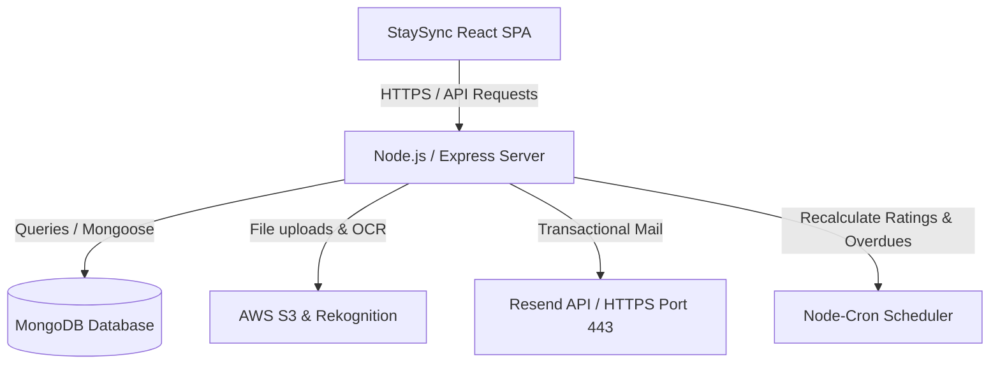

# StaySync Project Overview

StaySync is a comprehensive Paying Guest (PG) management platform designed to streamline operations for property owners and managers while delivering an elegant stay-discovery and rent-tracking experience for tenants.

---

## Table of Contents
1. [Executive Summary](#1-executive-summary)
2. [Architecture Overview](#2-architecture-overview)
3. [Core Purpose](#3-core-purpose)
4. [Feature Breakdown](#4-feature-breakdown)
5. [Folder Structure](#5-folder-structure)
6. [Data Models](#6-data-models)
7. [API Documentation](#7-api-documentation)
8. [Business Logic & Workflows](#8-business-logic--workflows)
9. [External Dependencies](#9-external-dependencies)
10. [Sequence Flows](#10-sequence-flows)
11. [Technical Decisions](#11-technical-decisions)
12. [Current Capabilities](#12-current-capabilities)
13. [Limitations & Future Enhancements](#13-limitations--future-enhancements)
14. [PRD Context (PRD Foundation)](#14-prd-context-prd-foundation)

---

## 1. Executive Summary
* **Project Name**: StaySync
* **One-line Description**: An end-to-end PG accommodation management and stay-discovery platform with automated billing, vacancy updates, staff payroll, and tenant feedback loops.
* **Problem Solved**: Replaces fragmented manual workflows (spreadsheets, paper receipts, cash checks) used by PG owners with automated invoice generation, rent tracking, staff payroll logs, and geolocated tenant stays.
* **Target Users**:
  * **Property Owners**: Oversee collections, staff payroll, vacancies, and expenses.
  * **Property Managers**: Handle check-ins, approve tenant payments, log expenses, and update room states.
  * **Tenants (Students/Professionals)**: Discover properties, track rent bills, submit UPI/cash payment receipts, and submit ratings.
  * **Staff (Employees)**: Perform maintenance, record expenses, and log salary payouts.
* **Business Purpose**: Standardize PG operations to maximize occupancy rates, decrease revenue leakage from late rent, and improve tenant retention through high-fidelity ratings and feedback loops.

---

## 2. Architecture Overview
StaySync uses a decoupled Client-Server architecture:

* **High-Level Flow**:
  * The frontend is a React Single Page Application (SPA) bundled via Vite.
  * The backend is a RESTful Node.js service using Express, connected to MongoDB via Mongoose.
  * Authentication is sessionless, powered by JSON Web Tokens (JWT) signed and verified symmetrically on the server.
  * Third-party services like AWS S3 handle storage, and AWS Rekognition performs OCR validation of tenant identification documents (Aadhar).

---

## 3. Core Purpose
Managing multiple residential properties requires tracking overlapping variables: monthly rent generation, utilities, prorated check-ins, security deposits, staff payroll, properties maintenance expenses, and empty bed lists. 

StaySync simplifies this by serving as a single source of truth. It automates calculations (prorated rent billing, late fees) and makes property discovery transparent through real-time vacancies, geolocated proximity search, and verified tenant review metrics.

---

## 4. Feature Breakdown

### Authentication & Authorization
* **Purpose**: Secures application endpoints and guarantees role-based permissions (User/Tenant, Owner, Manager, Employee, Admin).
* **User Flow**: Users signup or signin on the React client. When logging in, they receive a JWT access token stored in memory, with a profile payload cached in local storage.
* **How It Works**: Handled via Passport-JWT strategy. Roles are verified using the `auth(...rights)` middleware.
* **Key Files**: 
  * [auth.route.js](file:///c:/Users/AM-LP-64/Documents/SAGAR/PG-Management/PG-backend/src/routes/auth.route.js)
  * [auth.controller.js](file:///c:/Users/AM-LP-64/Documents/SAGAR/PG-Management/PG-backend/src/controllers/auth.controller.js)
  * [auth.js](file:///c:/Users/AM-LP-64/Documents/SAGAR/PG-Management/PG-backend/src/middlewares/auth.js)
  * [AuthContext.jsx](file:///c:/Users/AM-LP-64/Documents/SAGAR/PG-Management/PG-frontend/src/context/AuthContext.jsx)
* **Inputs/Outputs**:
  * Input: `email`, `password`
  * Output: `{ user: { id, role, email... }, tokens: { access: { token, expires } } }`

### Geolocated Stay & PG Discovery
* **Purpose**: Allows tenants to search active room vacancies and filter by distance, budget, gender preference, and facilities.
* **User Flow**: A user visits the browse page, grants location permissions (or triggers "Near Me"), and views accommodation listings ordered by distance, complete with maps and vacancy tags.
* **How It Works**: Frontend retrieves GPS coordinates via HTML5 Geolocation. The backend discovery controller executes a Mongo `$near` query on the geospatial 2dsphere index coordinates of the PG location. Exact distance in km is calculated on-the-fly via the Haversine formula and injected into the response.
* **Key Files**:
  * [BrowsePGs.jsx](file:///c:/Users/AM-LP-64/Documents/SAGAR/PG-Management/PG-frontend/src/pages/user/BrowsePGs.jsx)
  * [BrowsePosts.jsx](file:///c:/Users/AM-LP-64/Documents/SAGAR/PG-Management/PG-[#6c63ff] PG-frontend/src/pages/user/BrowsePosts.jsx)
  * [pg.service.js](file:///c:/Users/AM-LP-64/Documents/SAGAR/PG-Management/PG-backend/src/services/pg.service.js)
  * [post.service.js](file:///c:/Users/AM-LP-64/Documents/SAGAR/PG-Management/PG-backend/src/services/post.service.js)

### Rent Tracker & Invoicing
* **Purpose**: Automates monthly billing, payment proof checks, and cash/online receipt logging.
* **User Flow**: 
  * At the start of the month, a cron job generates bills. 
  * Owners/Managers can also generate bills manually.
  * Tenants see the outstanding bill in "My Rent", click "Pay", submit transaction reference numbers, and upload payment screenshots.
  * Managers verify the screenshot, click "Approve", updating the status to "Paid".
* **How It Works**: Rent payments map a Tenant, Bed, Room, and PG. Late payments automatically receive late fees once past the PG's due date. Invalidation query keys are refreshed upon receipt uploads to avoid cache desyncs.
* **Key Files**:
  * [RentTracker.jsx](file:///c:/Users/AM-LP-64/Documents/SAGAR/PG-Management/PG-frontend/src/pages/owner/RentTracker.jsx)
  * [MyRent.jsx](file:///c:/Users/AM-LP-64/Documents/SAGAR/PG-Management/PG-frontend/src/pages/user/MyRent.jsx)
